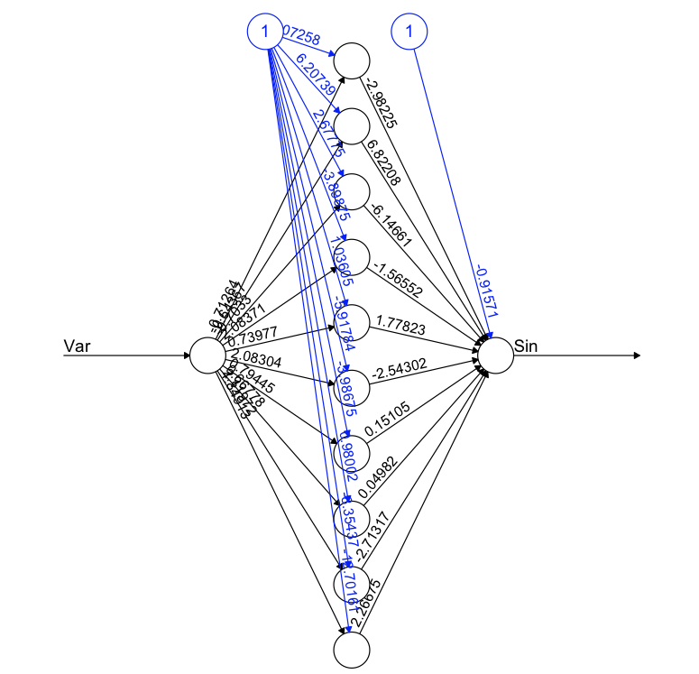

```{r setup, include=FALSE}
knitr::opts_chunk$set(
	echo = FALSE,
	message = FALSE,
	warning = FALSE
)
```

# Lab 3

## Assignment 1 - Gaussian kernel

Assignment 1 is about implementing a kernel method for to predict the hourly temperature for a user-defined date and place in Sweden. In the code below the chosen date is $2001-07-24$ and the place is Stockholm defined by the coordinated $59.325$, $18.071$. I implemented three kernels based on the date, time and distance using a gaussian kernel with the gaussian function $e^{-u^2}$.

```{r}
setwd("~/Programming/TDDE01/Lab 3")
RNGversion('3.5.1')
set.seed(1234567890)

library("geosphere")

stations <- read.csv("stations.csv")
temps <- read.csv("temps50k.csv")
st <- merge(stations, temps, by = "station_number")

## These values are up to the user. ud = user defined
ud.lat <- 58.4274 # The lat of the point to predict
ud.long <- 14.826 # The long of the point to predict
ud.date <-"2004-07-04" # The date to predict (up to the students) 
ud.h_distance <- 100000
ud.h_date <- 20
ud.h_time <- 4
##End input

ud.times <- c("04:00:00", "06:00:00","08:00:00","10:00:00","12:00:00","14:00:00",
           "16:00:00","18:00:00","20:00:00","22:00:00", "24:00:00")

#Filters posterior date
filterPosteriorDate <- function(data,date) {
  return(data[!(as.Date(data$date)-as.Date(date))>0,])
}

#Filters posterior time
filterPosteriorTime <- function(data, date, time) {
  return (data[!(as.Date(data$date) == as.Date(date) & 
                 as.numeric(difftime(strptime(data$time, format="%H:%M:%S"), 
                 strptime(time, format="%H:%M:%S"))) > 0 ),])
}


#Kernel for distance computing to point of interest
distGaussian <- function(data, target, h) {
  dist <- distHaversine(data.frame(data$longitude,data$latitude), target)
  u <- dist/h
  return (exp(-(u)^2));
}

#Kenrel for date
dateGaussian <- function(data, target, h) {
  date_diff <- as.numeric(as.Date(data$date)-as.Date(target), unit="days")
  u <- date_diff/h
  return(exp(-(u)^2))
}

#Kernel for time
timeGaussian <- function(data,target,h) {
  time_difference <- difftime(strptime(data$time, format="%H:%M:%S"), 
                              strptime(target, format="%H:%M:%S"))
  u <- as.numeric(time_difference)/h
  return(exp(-(u)^2))
}
  
tempEst <- function(data) {
  filtered_data <- filterPosteriorDate(data, ud.date)
  length=length(ud.times) 
  t_sum <- vector(length=length)
  t_multi <- vector(length=length)
  for  (i in 1:length) {
    filtered_data_by_time <- filterPosteriorTime(filtered_data, ud.date, ud.times[i])
    time <- timeGaussian(filtered_data_by_time, ud.times[i], ud.h_time)
    distance <- distGaussian(filtered_data_by_time, data.frame(ud.long, ud.lat), ud.h_distance)
    day <- dateGaussian(filtered_data_by_time, ud.date, ud.h_date)
    kernel_sum <- distance + day + time
    kernel_multi <- distance * day * time
    t_sum[i] <- sum(kernel_sum %*% filtered_data_by_time$air_temperature)/sum(kernel_sum)
    t_multi[i] <- sum(kernel_multi %*% filtered_data_by_time$air_temperature)/sum(kernel_multi)
  }
  
  return(list(t_sum=t_sum, t_multi=t_multi))
}
  
temps <- tempEst(st)

plot(temps$t_sum,xaxt='n', xlab="Time", 
     ylab="Temperature", type="o", main = "Sum of kernels")
axis(1, at=1:length(ud.times), labels=ud.times)

```

The plot above shows the kernel for the sum of the kernels.

``` {r}

plot(temps$t_multi,xaxt='n', xlab="Time", 
     ylab="Temperature", type="o", main = "Product of kernels")
axis(1, at=1:length(ud.times), labels=ud.times)

```

The plot above shows the plot for the product of kernels. As one can see the product of the kernels is a lot better at predicting the temperature than the sum.

As one can see there is quite a big difference between the sum of the kernels and the product of the kernels. The reason for them looking so different from each other is that the way the different k-values are handled. As in the sum of kernels the the k-values are just added on top of each other, which adds noise to the prediction and a low value of one kernel doesn't really affect the rest of the kernels. Although, with the multiplication of the k-values a low value for say the date makes that whole prediction for that temperature really low, which is more accurate.

The width chosen for the three kernels are $100 000$ for distance, $20$ for date and $4$ for time. The reasoning for the kernel width is that it gives the most spread out data points for each respective value. If the h-value is too high the kernel-value will be too large and affect the tempereature too much. So what one is looking for is having a good balance between the different kernels, adjusted by the h-value. 

So what I did was try the different h-values was to plot them with different values of the chosen kernel.

```{r}
h_test.plotKernalDistance <- function(distances, h) {
  u <- distances/h
  k <- exp(-u^2)
  plot(k, type="l", main = "H value for distance", xlab="Distance",)
}

h_test.plotKernalDate <- function(date_diff, h) {
  u <- date_diff/h
  k <- exp(-u^2)
  plot(k, type="l", main = "H value for date", xlab="Days", xlim=c(0,100))
}

h_test.plotKernalHour <- function(time_diff, h) {
  u <- time_diff/h
  k <- exp(-u^2)
  plot(k, type="l", main = "H value for hour", xlab="Hours", xlim=c(0,24))
}

h_test.distance <- seq(0,300000,1)
h_test.date_diff <- seq(0,100,1)
h_test.time_diff <- seq(0,50,1)
h_test.plotKernalDistance(h_test.distance, ud.h_distance)
```

Above is the plot for different values dor the distance can be seen for the chosen h, which is $100 000$. As one can see the kernel is affected a lot more by stations that are close to the chosen position than the ones farther away.

``` {r}

h_test.plotKernalDate(h_test.date_diff, ud.h_date)

```

Above is the plot for days. The chosen h-value makes it so that the closer the day is the more it affects the date, which is reasonable as that makes it be affcted by what hour it is.

``` {r}

h_test.plotKernalHour(h_test.time_diff, ud.h_time)

```

Above is the plot for what hour it is. As one can see that with the chosen h-value only the hours that are close to the hour to be estimated is affecting the estimation of the temperature.

\newpage

## Assignment 3 - Neural network for the sinus function

Assignment 3 is about implementing a neural network for the sinus function based on 50 data points and then choosing the best 

```{r}

library(neuralnet)
library(ggplot2)

set.seed(1234567890)
#50 values between 0 and 10
Var <- runif(50, 0, 10)

# Create dataset
trva <- data.frame(Var, Sin=sin(Var))

# Divide dataset into training and validation set
tr <- trva[1:25,] # Training
va <- trva[26:50,] # Validation

# Random initialization of the weights in the interval [-1, 1]
# 31 weights are used
winit <- runif(31, -1, 1)

# Function predicting MSE
mse <- function(prediction, observation) {
  return (mean((observation - prediction)^2))
}

mse_val <- numeric()
mse_train <- numeric()
threshold <- numeric()
m_sq_err <- function(pred, obs) {
  return (mean((observation - prediction)^2))
}

for(i in 1:10) {
  nn <- neuralnet(Sin ~ Var, data = tr, startweights = winit, hidden = c(10),
                  threshold = i/1000)
  
  pred_train <- compute(nn, covariate=tr)$net.result
  pred_val <- compute(nn, covariate=va)$net.result
  threshold[i] <- i/1000
  mse_val[i] <- mse(pred_val, va$Sin)
  mse_train[i] <- mse(pred_train, tr$Sin)

}

plot(threshold, mse_train, type="o", ylab="MSE", main = "Training dataset")
plot(threshold, mse_val, type="o", ylab="MSE", main = "Validation dataset")

```

The plots above shows the MSE for the validaiton dataset and the training dataset. One can see that the MSE is lowest for $i=4$ in the validation plot, and is thereby chosen for the neural network.

```{r}

# Your code here
nn <- neuralnet(Sin ~ Var, data = trva, startweights = winit, hidden = c(10),
                     threshold = 4/1000)
plot(nn)
```



Above the neural net can be seen with its' 10 hidden nodes and its' acoompanying values.

```{r}
pred_nn <- prediction(nn)$rep1
plot_net <- ggplot() + geom_point(aes(pred_nn[,1], pred_nn[,2])) + 
  geom_point(aes(trva$Var, trva$Sin), colour="red")
plot_net
```

Finally the plot with the predicted data (black points) plotted against the original data(red points). As one can see the points almost perfectly line up, which is the desired outcome.

\newpage

# Appendices for code

## Appendix 1 - Code for assignment 1

```{r echo=TRUE, warning=FALSE, eval=FALSE}
setwd("~/Programming/TDDE01/Lab 3")
RNGversion('3.5.1')
set.seed(1234567890)

library("geosphere")

stations <- read.csv("stations.csv")
temps <- read.csv("temps50k.csv")
st <- merge(stations, temps, by = "station_number")

## These values are up to the user. ud = user defined
ud.lat <- 59.325 # The lat of the point to predict
ud.long <- 18.071 # The long of the point to predict
ud.date <-"2016-12-24" # The date to predict (up to the students) 
ud.h_distance <- 100000
ud.h_date <- 10
ud.h_time <- 4
##End input

ud.times <- c("04:00:00", "06:00:00","08:00:00","10:00:00","12:00:00","14:00:00",
           "16:00:00","18:00:00","20:00:00","22:00:00", "24:00:00")

#Filters posterior date
filterPosteriorDate <- function(data,date) {
  return(data[!(as.Date(data$date)-as.Date(date))>0,])
}

#Filters posterior time
filterPosteriorTime <- function(data, date, time) {
  return (data[!(as.Date(data$date) == as.Date(date) & 
                 as.numeric(difftime(strptime(data$time, format="%H:%M:%S"), 
                 strptime(time, format="%H:%M:%S"))) > 0 ),])
}


#Kernel for distance computing to point of interest
distGaussian <- function(data, target, h) {
  dist <- distHaversine(data.frame(data$longitude,data$latitude), target)
  u <- dist/h
  return (exp(-(u)^2));
}

#Kenrel for date
dateGaussian <- function(data, target, h) {
  date_diff <- as.numeric(as.Date(data$date)-as.Date(target), unit="days")
  u <- date_diff/h
  return(exp(-(u)^2))
}

#Kernel for time
timeGaussian <- function(data,target,h) {
  time_difference <- difftime(strptime(data$time, format="%H:%M:%S"), 
                              strptime(target, format="%H:%M:%S"))
  u <- as.numeric(time_difference)/h
  return(exp(-(u)^2))
}
  
tempEst <- function(data) {
  filtered_data <- filterPosteriorDate(data, ud.date)
  length=length(ud.times) 
  t_sum <- vector(length=length)
  t_multi <- vector(length=length)
  for  (i in 1:length) {
    filtered_data_by_time <- filterPosteriorTime(filtered_data, ud.date, ud.times[i])
    time <- timeGaussian(filtered_data_by_time, ud.times[i], ud.h_time)
    distance <- distGaussian(filtered_data_by_time, data.frame(ud.long, ud.lat), ud.h_distance)
    day <- dateGaussian(filtered_data_by_time, ud.date, ud.h_date)
    kernel_sum <- distance + day + time
    kernel_multi <- distance * day * time
    t_sum[i] <- sum(kernel_sum %*% filtered_data_by_time$air_temperature)/sum(kernel_sum)
    t_multi[i] <- sum(kernel_multi %*% filtered_data_by_time$air_temperature)/sum(kernel_multi)
  }
  
  #Used to view the values of each k everytime I run to get an understanding
  #of how the values look like for each respective run.
  View(distance)
  View(day)
  View(time)
  
  return(list(t_sum=t_sum, t_multi=t_multi))
}
  
temps <- tempEst(st)

plot(temps$t_sum,xaxt='n', xlab="Time", 
     ylab="Temperature", type="o", main = "Sum of kernels")
axis(1, at=1:length(ud.times), labels=ud.times)

plot(temps$t_multi,xaxt='n', xlab="Time", 
     ylab="Temperature", type="o", main = "Multiplication of kernels")
axis(1, at=1:length(ud.times), labels=ud.times)


#Below is the h-tests
h_test.plotKernalDistance <- function(distances, h) {
  u <- distances/h
  k <- exp(-u^2)
  plot(k, type="l", main = "H value for distance", xlab="Distance",)
}

h_test.plotKernalDate <- function(date_diff, h) {
  u <- date_diff/h
  k <- exp(-u^2)
  plot(k, type="l", main = "H value for date", xlab="Days",)
}

h_test.plotKernalHour <- function(time_diff, h) {
  u <- time_diff/h
  k <- exp(-u^2)
  plot(k, type="l", main = "H value for hour", xlab="Hours", xlim=c(0,12))
}

h_test.distance <- seq(0,300000,1)
h_test.date_diff <- seq(0,20,1)
h_test.time_diff <- seq(0,50,1)

h_test.plotKernalDistance(h_test.distance, ud.h_distance)
h_test.plotKernalDate(h_test.date_diff, ud.h_date)
h_test.plotKernalHour(h_test.time_diff, ud.h_time)


```

## Appendix 2 - Code for assignment 3

```{r echo=TRUE, warning=FALSE, eval=FALSE}

library(neuralnet)
library(ggplot2)

set.seed(1234567890)
#50 values between 0 and 10
Var <- runif(50, 0, 10)

# Create dataset
trva <- data.frame(Var, Sin=sin(Var))

# Divide dataset into training and validation set
tr <- trva[1:25,] # Training
va <- trva[26:50,] # Validation

# Random initialization of the weights in the interval [-1, 1]
# 31 weights are used
winit <- runif(31, -1, 1)

# Function predicting the mean square error
mse <- function(prediction, observation) {
  return (mean((observation - prediction)^2))
}

mse_val <- numeric()
mse_train <- numeric()
threshold <- numeric()
m_sq_err <- function(pred, obs) {
  return (mean((observation - prediction)^2))
}

for(i in 1:10) {
  nn <- neuralnet(Sin ~ Var, data = tr, startweights = winit, hidden = c(10),
                  threshold = i/1000)
  
  pred_train <- compute(nn, covariate=tr)$net.result
  pred_val <- compute(nn, covariate=va)$net.result
  threshold[i] <- i/1000
  mse_val[i] <- mse(pred_val, va$Sin)
  mse_train[i] <- mse(pred_train, tr$Sin)
  print(i)
  
}

plot(threshold, mse_val, type="o", ylab="MSE", main = "Validation dataset")
plot(threshold, mse_train, type="o", ylab="MSE", main = "Training dataset")

nn <- neuralnet(Sin ~ Var, data = trva, startweights = winit, hidden = c(10),
                     threshold = 4/1000)
plot(nn)

pred_nn <- prediction(nn)$rep1
plot_net <- ggplot() + geom_point(aes(pred_nn[,1], pred_nn[,2])) + 
  geom_point(aes(trva$Var, trva$Sin), colour="red")
plot_net

```
