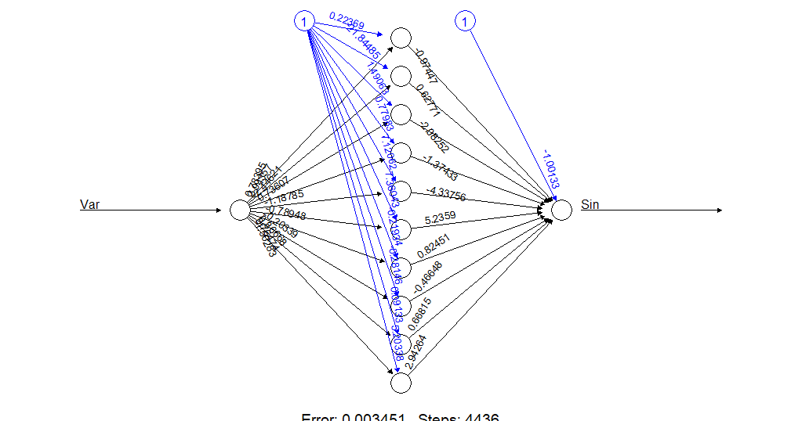

```{r setup, include=FALSE}
knitr::opts_chunk$set(
	echo = FALSE,
	message = FALSE,
	warning = FALSE
)
```

# Assignment 1 
```{r, code=readLines("Ass 1.R"), include=FALSE}
```
In this assignment we implemented a kenrel method to predict hourly temperatures for a date and place in Sweden. For this we used a kernel that is the sum of three Gaussian kernels.
1. Distance from observed weather station to point of interest.
2. Days between observed date and date of interest (days of the year).
3. Hours between observed time and time of interest.

The smoothing coefficients for the three gaussian kernels were chosen so that it they would look similar to the function of $k(u)=e^{-u^2}$, as of graph below.

```{r echo=FALSE}
plot.comparison
```

When predicting the temperature for 2013-04-07 in Vadstena (Latitude: 58.4274, Longitude: 14.826) the following plots of the k-value is obtained.

```{r echo=FALSE}
plot.distance
plot.date
plot.time
```
As visualised by the date-plot, the k-value is dependent on how close the observed date is to the date of interest - this is by the year, which means that for example 5th of August 2019 is equally much accounted for as 5th of Augsut 2018. 


When predicting the temperature for 2013-04-07 in Vadstena (same as above), the following graphs were obtained. The first graph by using the sum of the three gaussian kernels and second by using the product of the three gaussian kernels.

```{r echo=FALSE,  fig.width=8}
plot.sum
plot.product
```
The second plot is more even is by the look of it more correct (comapred to regular weather predictions). This may be because when using the sum of the gaussian kernels the correct values are not as greatly differenting from the "incorrect values". On the contrary, when multiplying the gaussian kernels the correct values gives much greater input than the incorrect values.

This could be handled by choosing more sensitive coefficient for the sum-model.


\newpage

# Assignment 3 - Neural network for the sinus function

Assignment 3 is about implementing a neural network for the sinus function based on 50 data points and then choosing the best 

```{r}

library(neuralnet)
library(ggplot2)

set.seed(1234567890)
#50 values between 0 and 10
Var <- runif(50, 0, 10)

# Create dataset
trva <- data.frame(Var, Sin=sin(Var))

# Divide dataset into training and validation set
tr <- trva[1:25,] # Training
va <- trva[26:50,] # Validation

# Random initialization of the weights in the interval [-1, 1]
# 31 weights are used
winit <- runif(31, -1, 1)

# Function predicting MSE
mse <- function(prediction, observation) {
  return (mean((observation - prediction)^2))
}

mse_val <- numeric()
mse_train <- numeric()
threshold <- numeric()
m_sq_err <- function(pred, obs) {
  return (mean((observation - prediction)^2))
}

for(i in 1:10) {
  nn <- neuralnet(Sin ~ Var, data = tr, startweights = winit, hidden = c(10),
                  threshold = i/1000)
  
  pred_train <- compute(nn, covariate=tr)$net.result
  pred_val <- compute(nn, covariate=va)$net.result
  threshold[i] <- i/1000
  mse_val[i] <- mse(pred_val, va$Sin)
  mse_train[i] <- mse(pred_train, tr$Sin)

}

plot(threshold, mse_train, type="o", ylab="MSE", main = "Training dataset")
plot(threshold, mse_val, type="o", ylab="MSE", main = "Validation dataset")

```

The plots above shows the MSE for the validaiton dataset and the training dataset. One can see that the MSE is lowest for $i=4$ in the validation plot, and is thereby chosen for the neural network.

```{r}

# Your code here
nn <- neuralnet(Sin ~ Var, data = trva, startweights = winit, hidden = c(10),
                     threshold = 4/1000)
plot(nn)
```



Above the neural net can be seen with its' 10 hidden nodes and its' acoompanying values.

```{r}
pred_nn <- prediction(nn)$rep1
plot_net <- ggplot() + geom_point(aes(pred_nn[,1], pred_nn[,2])) + 
  geom_point(aes(trva$Var, trva$Sin), colour="red")
plot_net
```

Finally the plot with the predicted data (black points) plotted against the original data(red points). As one can see the points almost perfectly line up, which is the desired outcome.

\newpage

# Appendices

## Appendix I - Assignment 1
```{r, code=readLines("Ass 1.R"), echo=TRUE, eval=FALSE}
```

## Appendix II - Assignment 3

```{r echo=TRUE, warning=FALSE, eval=FALSE}

library(neuralnet)
library(ggplot2)

set.seed(1234567890)
#50 values between 0 and 10
Var <- runif(50, 0, 10)

# Create dataset
trva <- data.frame(Var, Sin=sin(Var))

# Divide dataset into training and validation set
tr <- trva[1:25,] # Training
va <- trva[26:50,] # Validation

# Random initialization of the weights in the interval [-1, 1]
# 31 weights are used
winit <- runif(31, -1, 1)

# Function predicting the mean square error
mse <- function(prediction, observation) {
  return (mean((observation - prediction)^2))
}

mse_val <- numeric()
mse_train <- numeric()
threshold <- numeric()
m_sq_err <- function(pred, obs) {
  return (mean((observation - prediction)^2))
}

for(i in 1:10) {
  nn <- neuralnet(Sin ~ Var, data = tr, startweights = winit, hidden = c(10),
                  threshold = i/1000)
  
  pred_train <- compute(nn, covariate=tr)$net.result
  pred_val <- compute(nn, covariate=va)$net.result
  threshold[i] <- i/1000
  mse_val[i] <- mse(pred_val, va$Sin)
  mse_train[i] <- mse(pred_train, tr$Sin)
  print(i)
  
}

plot(threshold, mse_val, type="o", ylab="MSE", main = "Validation dataset")
plot(threshold, mse_train, type="o", ylab="MSE", main = "Training dataset")

nn <- neuralnet(Sin ~ Var, data = trva, startweights = winit, hidden = c(10),
                     threshold = 4/1000)
plot(nn)

pred_nn <- prediction(nn)$rep1
plot_net <- ggplot() + geom_point(aes(pred_nn[,1], pred_nn[,2])) + 
  geom_point(aes(trva$Var, trva$Sin), colour="red")
plot_net

```
